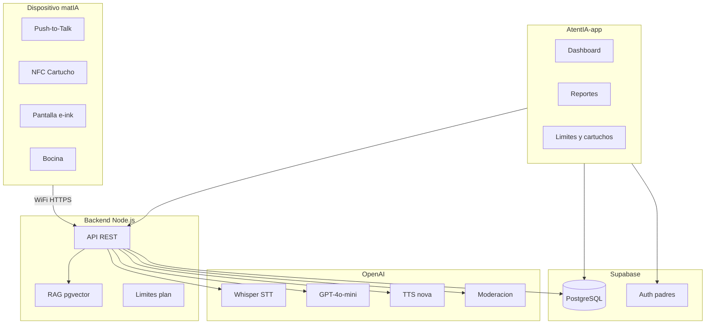

# 07 — Arquitectura del ecosistema

Visión de alto nivel de cómo se conectan las piezas. Detalle técnico completo en `AtentIA/matIA_Requerimientos_Tecnicos.md`.

---

## Componentes

---

## Flujo: niño pregunta a Mati

1. Niño presiona **PTT** → graba audio
2. Suelta PTT → dispositivo envía audio al backend
3. Backend verifica **límite plan** (Starter ≤ 30/día)
4. Whisper → texto
5. Moderación entrada
6. RAG recupera chunks del cartucho activo
7. GPT-4o-mini genera respuesta (prompt + historial sesión)
8. Moderación salida
9. TTS → MP3
10. Dispositivo reproduce + actualiza expresión e-ink
11. Backend guarda interacción → visible en app de padres

**Latencia objetivo:** < 2.5 s extremo a extremo.

---

## Flujo: padre revisa reporte

1. Padre abre AtentIA-app → Supabase Auth
2. App consulta `GET /api/parent/report/:child?level=basic|detailed|full`
3. Backend agrega sesiones, interacciones, progreso SM-2
4. Dashboard muestra métricas según nivel elegido

---

## Modo offline (dispositivo)

| Acción | Offline | Online |
|--------|---------|--------|
| Escuchar cuento pre-grabado | Sí | Sí |
| Preguntar a Mati (IA) | No | Sí |
| Sync progreso a app | Al reconectar | Tiempo real |

Mati (audio pre-grabado):
> *"Para hablar conmigo necesito internet. ¡Pero puedes seguir escuchando!"*

---

## Stack previsto

| Capa | Tecnología |
|------|------------|
| App padres | React Native o React PWA (por definir) |
| Landing | React + Vite (`AtentIA/client`) |
| Backend | Node.js (`AtentIA/server`) — Render |
| BD + Auth | Supabase (PostgreSQL + pgvector + Auth) |
| IA | OpenAI (Whisper, GPT-4o-mini, TTS, Moderation) |
| Pagos | Por definir (Stripe / Conekta) |

---

## API relevante para la app

| Endpoint | Uso en app |
|----------|------------|
| `GET /api/parent/report/:child` | Reportes |
| `POST /api/parent/limits` | Tiempo, horarios, cartuchos |
| `GET /api/cartridge/:id` | Metadata cartucho |
| Auth Supabase | Login padres |

Endpoints de sesión (`/api/session/*`) son **dispositivo ↔ backend**, no la app directamente.

---

## Datos clave en BD (referencia)

- `parents` — cuenta del padre
- `subscriptions` — plan_type: starter | unlimited
- `children` — un niño, daily_ai_questions, edad
- `sessions` / `interactions` — historial para reportes
- `concept_progress` — repetición espaciada
- `active_cartridges` — cartuchos activados por padre

---

## Proyectos en Bootcamp

| Ruta | Responsabilidad |
|------|-----------------|
| `AtentIA/client` | Landing marketing + waitlist |
| `AtentIA/server` | API waitlist (extender a matIA API) |
| `AtentIA-app/` | **App de padres** (esta carpeta, futuro código) |
| `AtentIA/matIA_Requerimientos_Tecnicos.md` | Spec técnica detallada |
| `AtentIA/README.md` | Contexto general del proyecto |

---

## Pendientes antes de codear la app

- [ ] Decidir React Native vs PWA
- [ ] Diseñar wireframes de 8 pantallas MVP
- [ ] Definir flujo emparejamiento dispositivo–cuenta
- [ ] Integrar pagos suscripción
- [ ] Backend endpoints padre en producción
